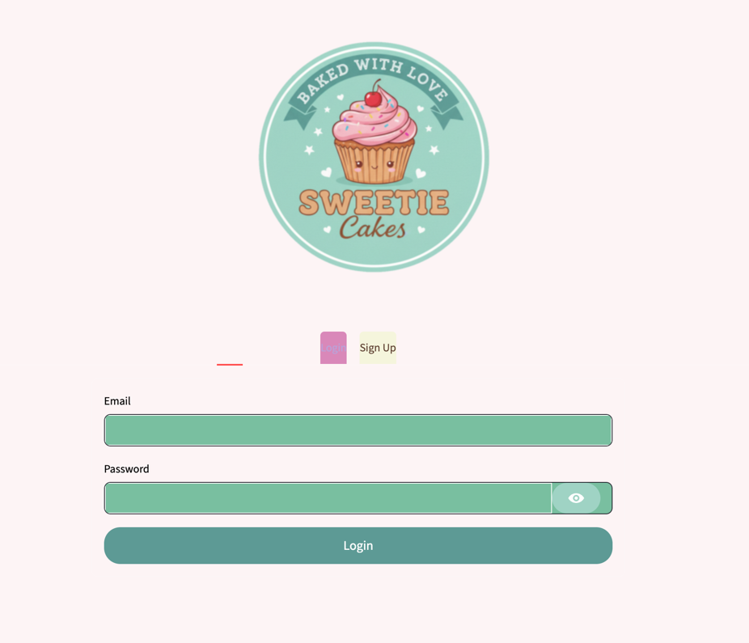
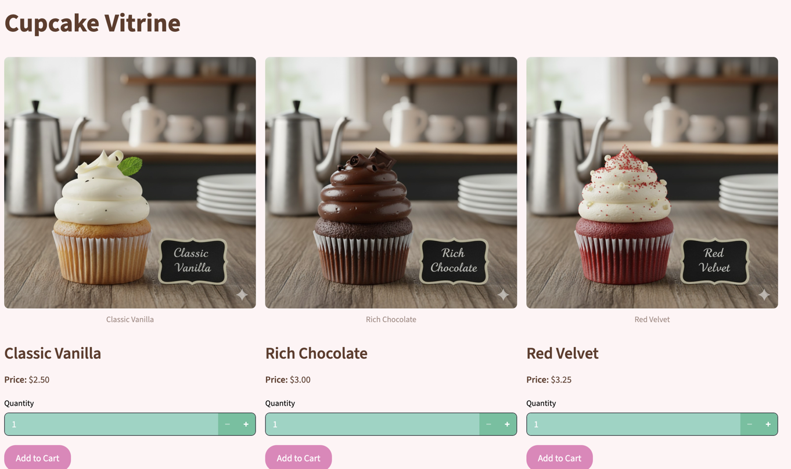
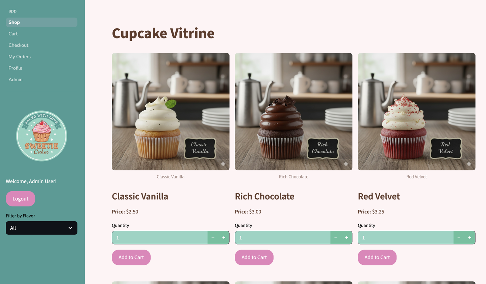
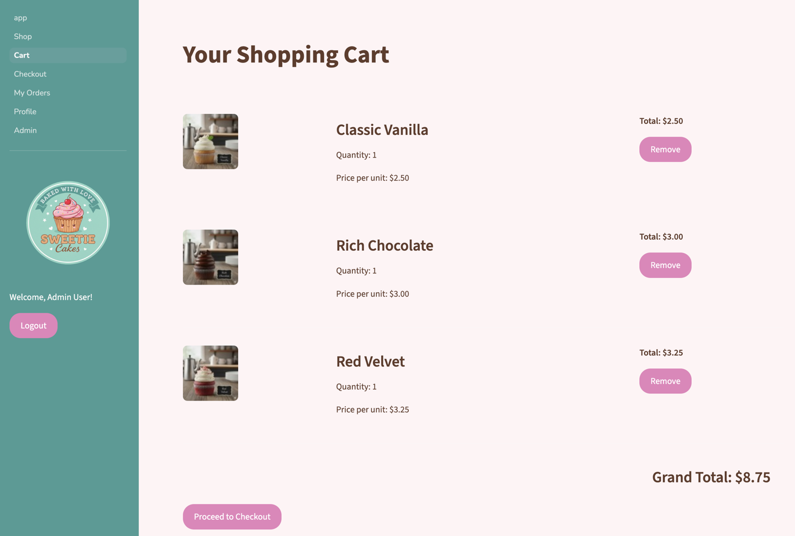
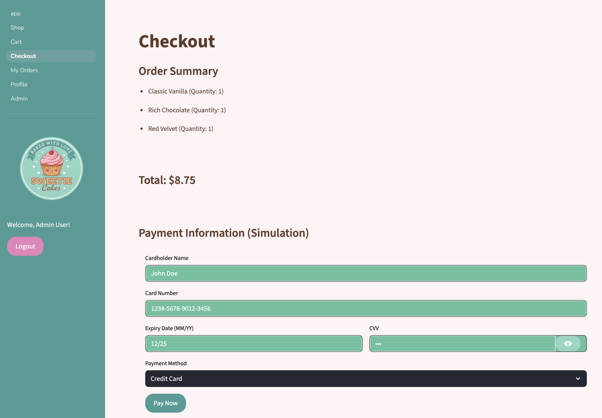
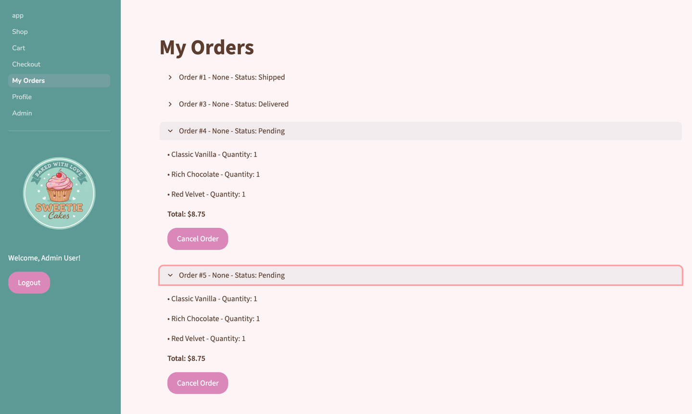
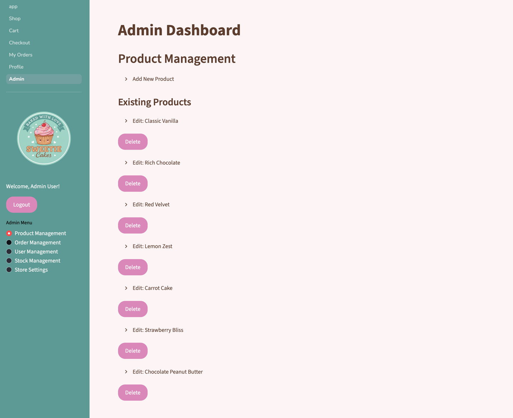
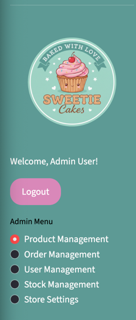

# PITII
Projeto Integrador Transdisciplinar em Engenharia de Software II - Cruzerio do Sul - UNIFRAN

## Descrição
O PITII é um projeto de engenharia de software que visa desenvolver uma plataforma de gestão de cupcakes, onde os usuários podem encontrar e compartilhar cupcakes de diferentes fabricantes.

## Tecnologias
- Python
- Streamlit
- SQLite
- SQLAlchemy

## Como executar
Para executar o projeto, siga os seguintes passos:
1. Clone o repositório.
2. Crie um ambiente virtual Python com o Python 3.11.
3. Instale as dependências do projeto usando o pip. Execute o comando `pip install streamlit` no diretório do projeto.
4. Execute o arquivo `app.py` para iniciar o aplicativo. Você pode fazer isso usando o comando `streamlit run app.py` no diretório do projeto.
5. Acesse a URL do aplicativo no seu navegador.
6. Crie uma conta e faça login para começar a usar o aplicativo.
7. Experimente a funcionalidade do aplicativo e compartilhe com seus amigos!

##Vídeo
https://github.com/user-attachments/assets/8150ed7c-9bbd-4a52-9afd-cd998838738c

## Demonstração
https://cupcakestore-pitii.streamlit.app/

## Screenshots

## Autores
- André Pereira
